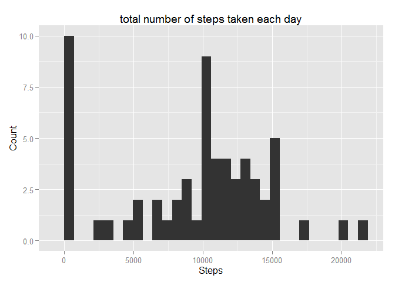
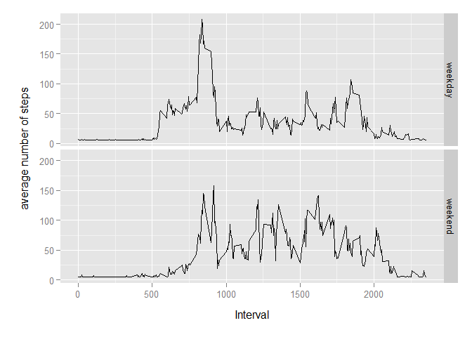

# Peer Assessment # 1 - Repoducible research

In this document I'm going to save all the steps that I use to solve the first peer assessment activity in the Reproducible Research course.

**Loading and preprocessing the data**

The very fist thing is to read the available dataset and set it to a variable:

```r
activityDataset <- read.csv("activity.csv", colClasses = c("integer", "character", "integer"))
```

**What is mean total number of steps taken per day?**

To give an answer to this question I should split it in three parts, first I need to calculate the total number of steps taken per day and this is the code that solves that:

```r
sum(activityDataset$steps, na.rm = TRUE)
```

```
## [1] 570608
```

To have an idea about the data behaivor I have to make a histogram of the total number of steps taken each day, this is done by the following code:


```r
library(ggplot2)
activityDataset$date <- as.Date(activityDataset$date)
stepsPerDay <- tapply(activityDataset$steps, activityDataset$date, sum, na.rm=TRUE)
qplot(
    stepsPerDay,
    geom="histogram",
    main = "total number of steps taken each day",
    xlab = "Steps",
    ylab = "Count")
```

```
## stat_bin: binwidth defaulted to range/30. Use 'binwidth = x' to adjust this.
```

 

```r
# I store the plot in a PNG file
ggsave(filename = "figures/plot1.png")
```

```
## Saving 7 x 5 in image
## stat_bin: binwidth defaulted to range/30. Use 'binwidth = x' to adjust this.
```

Finally I calculate the mean and median of the total number of steps taken per day:

**Mean**: 9354.2295082

**Median**: 10395

**What is the average daily activity pattern?**

To start answering this question I'm going to plot the average number of steps taken in 5-minute intervals, averaged across all days.


```r
stepsAvgPerIntervalsPerDay <- aggregate(steps ~ interval,data = activityDataset, mean)

graphic <- ggplot(
    stepsAvgPerIntervalsPerDay,
    aes(interval, steps),
    xlab = "Interval",
    ylab = "Steps average"
)+geom_line()
graphic
```

 

```r
# I store the plot in a PNG file
ggsave(filename = "figures/plot2.png")
```

```
## Saving 7 x 5 in image
```

**Imputing missing values**

Total number of rows with `NA`s; 2304

The strategy for filling this missing values is to use the mean of steps by interval, this is done with this code:

```r
tidyActivityDataset <- activityDataset
tidyActivityDataset[is.na(tidyActivityDataset), ]$steps <- mean(stepsAvgPerIntervalsPerDay$steps)
stepsPerDayInTidyDataset <- tapply(tidyActivityDataset$steps, 
                                   tidyActivityDataset$date, sum)
options(scipen=4)
```

**Mean**: 10766.1886792

**Median**: 10766.1886792

This values differ from the past value, they are a little bit higher and because I use this method to fill missing data mean and median are the same.


**Are there differences in activity patterns between weekdays and weekends?**

I need to create a new column in the filled dataframe with the weekday o weekend, this is done with this code:


```r
weekday <- c("lunes", "martes", "miércoles", "jueves", "viernes")
tidyActivityDataset$dayType <- ifelse(
    weekdays(as.Date(tidyActivityDataset$date)) %in% weekday,
    'weekday',
    'weekend'
)
                                      
summary(tidyActivityDataset$steps)
```

Now I can make a plot to solve this question:

```r
stepsPerIntervalWeek <- aggregate(steps ~ interval + dayType, data=tidyActivityDataset, mean)

ggplot(stepsPerIntervalWeek, aes(interval, steps)) + 
    geom_line() + 
    facet_grid(dayType ~ .) +
    xlab("Interval") + 
    ylab("average number of steps")
```

 

```r
# I store the plot in a PNG file
ggsave(filename = "figures/plot3.png")
```

```
## Saving 7 x 5 in image
```
